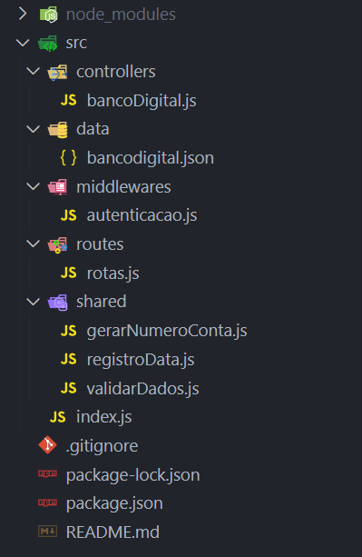

# API Rest - Banco Digital Cubos Bank

Projeto acadêmico do curso de Back-end da Cubos Academy. 

API Rest desenvolvida para representar as seguintes operações diárias de um sistema bancário:

* Criar conta bancária
* Listar contas bancárias
* Atualizar os dados do usuário da conta bancária
* Excluir uma conta bancária
* Depósitar em uma conta bancária
* Sacar de uma conta bancária
* Transferir valores entre contas bancárias
* Consultar saldo da conta bancária
* Emitir extrato bancário

Todos os dados serão armazenados localmente no arquivo bancodigital.json (Persistência de dados em disco).

## 🚀 Começando

Essas instruções permitirão que você obtenha uma cópia do projeto em operação na sua máquina local para fins de desenvolvimento e testes.

### 📋 Pré-requisitos

Antes de executar este projeto no seu computador, você precisará de alguns pacotes instalados como:

```
Node.js - Para executar os códigos Javascript fora do navegador;
Express - Pacote do Node.js para subir um servidor http localmente;
Date-fns - Para trabalhar com o registro de datas nas transferências entre contas.
Insomnia ou Postman - Para testar a API com requisições via GET, POST, PUT e DELETE.
```

### 🔧 Instalação


Para executar o projeto no seu ambiente de desenvolvimento em execução, primeiramente faça o clone desse repositório em sua maquina local na pasta desejada:

```
git clone https://github.com/flavioms86/desafio-carreira-banco-digital.git
```

Depois abra o projeto em seu editor de códigos, abra o terminal e digite o seguinte comando para a instalação dos pacotes e dependências necessárias:

```
npm install
```

Após a instalação, o servidor pode ser executado via nodemon (para não precisar restartar o servidor depois de alguma alteração):

```
npm run dev
```

Ou pelo node:

```
node .\src\index.js
```

O servidor estará executando localmente e aceitando requisições na porta 3000:

```
localhost:3000
```

## ⚙️ Estrutura do projeto



### 🔩 Endpoints da API Rest

Para testar a API use Insomnia ou Postman para fazer as requisições.

### Listar usuários da conta:

#### `GET` `/contas?senha_banco=Cubos123Bank`

Retorno (Aqui resumido para fins de demonstração):

```json
[
	{
		"numero": "1",
		"saldo": 220333,
		"usuario": {
			"nome": "Foo Bar",
			"cpf": "00011122233",
			"data_nascimento": "2021-03-15",
			"telefone": "71999998888",
			"email": "foo@bar.com",
			"senha": "1234"
		}
	}	
]
```

### Criar conta:

#### `POST` `/contas`

Requisição via json body.

```json
{
	"nome": "Sicrano Santos",
	"cpf": "11111111112",	
	"data_nascimento": "1990-01-01",
	"telefone": "83111111112",
	"email": "sicrano@santos.com",
	"senha": "1234"
}

```
Retorno:

```
204 No Content
```

### Atualizar usuário da conta:

#### `PUT` `/contas/:numeroConta/usuario`

Requisição via json body.

```json
{
	"nome": "Sicrano Santos Silva",
	"cpf": "11111111112",	
	"data_nascimento": "1990-01-01",
	"telefone": "83111111112",
	"email": "sicrano@santossilva.com",
	"senha": "1234"
}

```

Obs.: No parâmetro da URL :numeroConta coloque o numero da conta que deseja alterar o usuário.

Retorno:

```
204 No Content
```

### Excluir Conta:

#### `DELETE` `/contas/:numeroConta`

Requisição - Sem json body

Na URL:
```
localhost:3000/contas/2?senha_banco=Cubos123Bank
```
Obs.: No parâmetro da URL :numeroConta coloque o numero da conta que deseja excluir.

Retorno:

```
204 No Content
```

### Depositar na conta:

#### `POST` `/transacoes/depositar`

Requisição via json body.

```json
{
	"numero_conta": "2",
	"valor": 250000
}
```

Retorno:

```
204 No Content
```

### Sacar da conta:

#### `POST` `/transacoes/sacar`

Requisição via json body.

```json
{
	"numero_conta": "2",
	"valor": 100000,
	"senha": "1234"
}
```

Retorno:

```
204 No Content
```

### Tranferir saldo entre contas:

#### `POST` `/transacoes/transferir`

Requisição via json body.

```json
{
	"numero_conta_origem": "2",
	"numero_conta_destino": "1",
	"valor": 15000,
	"senha": "1234"
}
```

Retorno:

```
204 No Content
```

### Saldo da conta:

#### `GET` `/contas/saldo?numero_conta=123&senha=123`

Requisição - Sem json body

Na URL:
```
localhost:3000/contas/saldo?numero_conta=2&senha=1234&senha_banco=Cubos123Bank
```

Retorno:

```json
{
	"saldo": 135000
}
```

### Extrato da conta:

#### `GET` `/contas/extrato?numero_conta=123&senha=123`

Requisição - Sem json body

Na URL:
```
localhost:3000/contas/extrato?numero_conta=2&senha=1234&senha_banco=Cubos123Bank
```

Retorno:

```json
{
	"depositos": [
		{
			"data": "2023-09-10 12:19:43",
			"numero_conta": "2",
			"valor": 250000
		}
	],
	"saques": [
		{
			"data": "2023-09-10 12:19:45",
			"numero_conta": "2",
			"valor": 100000
		}
	],
	"transferenciasEnviadas": [
		{
			"data": "2023-09-10 12:19:48",
			"numero_conta_origem": "2",
			"numero_conta_destino": "1",
			"valor": 15000
		}
	],
	"transferenciasRecebidas": [
		{
			"data": "2023-09-10 12:20:15",
			"numero_conta_origem": "1",
			"numero_conta_destino": "2",
			"valor": 10000
		}
	]
}
```

### ⌨️ Ajustes e melhorias

O projeto poderá ter novos recursos e melhorias como:

- [ ] Remoção de registro de saques, depósitos e transferências quando um usuário é excluído do banco de dados.
- [ ] Persistência de dados em um banco de dados SQL ou NoSQL.
- [ ] Nova tarefa a ser definida.
- [ ] Nova tarefa a ser definida.
- [ ] Nova tarefa a ser definida.

## 🛠️ Construído com

Mencione as ferramentas que você usou para criar seu projeto

* [Node.js](https://nodejs.org/en) - Javascript runtime environment
* [Express](https://expressjs.com/pt-br/) - Framework para aplicação Web do Node.js

## ✒️ Autores

Mencione todos aqueles que ajudaram a levantar o projeto desde o seu início

* **Flávio M. Silva** - *Projeto Curso Backend M02* - [flavioms86](https://github.com/flavioms86)

## 📄 Licença

Não se aplica.
